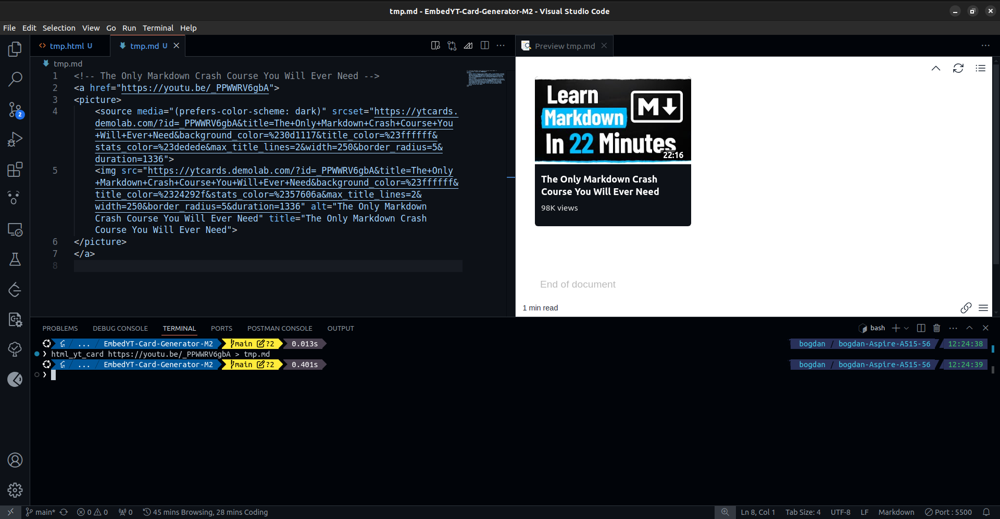

# Embed YouTube Card Generator

> **CLI** tool to create embedded YouTube cards for HTML/MarkDown projects.
>
> Bring your YouTube links to life!


🤖 Automate the boring stuff with Python!


🚀 Glow up your HTML/Markdown files with this simple Python script!
Just provide a YouTube URL as input, and it generates a sleek, clickable YouTube card for you.
Perfect for embedding videos in your blog, documentation, or personal projects.

This card comes with:

- 📺 An automatically generated thumbnail from the YouTube video.
- ▶️ A bold play button right in the center.
- 🔗 A clickable link to the video (both on the image and as text below).


> Checkout the other similar repo of mine [here](https://github.com/TrifanBogdan24/EmbedYT-Card-Generator-M1.git).


## Preview/Results





## Why use it?


If you want to make your HTML/Markdown files stand out and look clean,
this is exactly what you need!

No need to wrestle with complex embeds—this card is lightweight, visually appealing, and super easy to implement.


## What do you get?

Clean, ready-to-use HTML that you can drop anywhere:


```html
<!-- The Only Markdown Crash Course You Will Ever Need -->
<a href="https://youtu.be/_PPWWRV6gbA">
<picture>
	<source media="(prefers-color-scheme: dark)" srcset="https://ytcards.demolab.com/?id=_PPWWRV6gbA&title=The+Only+Markdown+Crash+Course+You+Will+Ever+Need&background_color=%230d1117&title_color=%23ffffff&stats_color=%23dedede&max_title_lines=2&width=250&border_radius=5&duration=1336">
	
</picture>
</a>
```

Rendered result:


## My Personal Motivation

✨ **I set out to bring boring, lifeless links in Markdown to life!** ✨

We've all seen those plain YouTube links in `.md` files that do nothing to grab attention.
My goal was to create a more engaging and visually appealing way to embed YouTube videos in Markdown files. With this script, those bland URLs transform into clickable, attractive YouTube cards that stand out.

When working with Markdown files, the results really shine when viewed with tools like:

- 🖼️ [`Markdown Preview Enhanced`](https://marketplace.visualstudio.com/items?itemName=shd101wyy.markdown-preview-enhanced) - great for local previews while you're editing.
- 📄 [`Markdown PDF`](https://marketplace.visualstudio.com/items?itemName=yzane.markdown-pdf) `+` [`PDF Viewer`](https://marketplace.visualstudio.com/items?itemName=tomoki1207.pdf) - perfect for exporting your Markdown into a professional-looking PDF.


> It also renders nice on `GitHub`.


Both locally, on PDFs, and remote,
the YouTube cards will **shine**! 🌟


## Source of inspiration


I found a relevant template for YouTube cards at the following GitHub repository:  
<https://github.com/DenverCoder1/github-readme-youtube-cards.git>.
The well-written documentation allowed me to get the HTML code, in which I was interested.


Despite the complexity of use specified in this repository
(which requires creating a GitHub Actions workflow to retrieve the actual HTML code),
I took a simpler and more user-friendly approach:
you only need to pass the URL of the YouTube video to the **CLI tool**,
and the HTML code will be displayed in the terminal.


Additionally, I used the **API** found at [ytcards.demolab.com](https://ytcards.demolab.com/)
to retrieve a pre-made YouTube card by simply passing parameters to the URL <https://ytcards.demolab.com/>.


## Description

This Python script is a **CLI tool**
that aims to generate HTML/MarkDown code
for a **clickable YouTube card**.


It will take a single argument in the command line,
the `URL`, representing the link to the YouTube Video/Short.


The script uses `pytube`/`pytubefix` **API** to automatically get
relevant data regarding the clip, including:
- Video ID
- Title
- Duration
- > No play button tho...


> A **default** version for <https://github.com/TrifanBogdan24/Customizable-EmbedYT-Card-Generator.git>


## Dependencies

This tool uses the `pytube`/`pytubefix` module.


```bash
# for getting YouTube clip info
$ pip3 install pytube
$ pip3 install pytubefix
```


> The **CLI tool** temporarily uses the `pytubefix` module
> instead of `pytube`, due to several issues.


Also, when running the `html_yt_card` **CLI tool** for the first time,
it **might** ask for authentication on Google.
Without authentication, you'll be seen as a bot and an error message will be dispalyed.


## Installation


Please see [install.sh](install.sh).


Run the following command in the `Linux` terminal:
```bash
$ chmod +x html_yt_card.py
$ sudo cp html_yt_card.py /usr/local/bin/html_yt_card
```


## Uninstall

You can use the script [uninstall.sh](uninstall.sh).

```bash
$ sudo rm -i /usr/local/bin/html_yt_card
```


## How to use it?

```bash
# Show help output
$ html_yt_card -h
$ html_yt_card --help


$ html_yt_card $URL 
$ html_yt_card --url=$URL


# This tool is more powerfull when used with redirection
$ html_yt_card $URL > READ-ME.md
$ html_yt_card $URL >> READ-ME.md
$ html_yt_card --url=$URL > READ-ME.md
$ html_yt_card --url=$URL >> READ-ME.md
```


> `--url=`
> This option expects a value after the **equal sign**,
> the URL of the YouTube clip.


## How to Run Using Python | An Alternative Approach


```bash
# Show help output
$ python3 html_yt_card.py -h
$ python3 html_yt_card.py --help


$ python3 html_yt_card.py $URL 
$ python3 html_yt_card.py --url=$URL


# This tool is more powerfull when used with redirection
$ python3 html_yt_card.py $URL > READ-ME.md
$ python3 html_yt_card.py $URL >> READ-ME.md
$ python3 html_yt_card.py --url=$URL > READ-ME.md
$ python3 html_yt_card.py --url=$URL >> READ-ME.md
```


## My advice on how to use it


- STEP 1: **Redirect** the output of the `html_yt_card` **CLI tool** to a temporary file

```bash
$ html_yt_card https://www.youtube.com/shorts/Nl9pcj79byY?feature=share > tmp.md
```


- STEP 2: Copy the content of the temporary file (in this case - *tmp.md*) and paste it where you need it


- STEP 3: Remove the temporary file


```bash
$ rm -f tmp.md
```

> NOTE:
> 
> Give it more tries.
> It might not work as expected in the first place.


## Copying the output of the CLI tool directly to `clipboard`


An alternative approach for the above advice would to
use an additional **command line tool**, that
being **piped** the output of `html_yt_card`,
it will copy it directly to **clipboard**.


On Linux, you can use `xclip`:
```bash
$ sudo apt-get install xclip


$ html_yt_card $ULR | xclip -selection clipboard
$ python3 html_yt_card.py $URL | xclip -selection clipboard


# It's a great ideea to alias it and place it in your configuration file
$ echo "alias clip='xclip -selection clipboard'" >> ~/.bashrc
$ source ~/.bahrc
$ type clip
```


On MacOS, you can use `pbcopy`:
```sh
$ html_yt_card $URL | pbcopy
$ python3 html_yt_card.py $URL | pbcopy
```


On Windows, you can use `clip`
```powershell
> html_yt_card $URL | clip
> python3 html_yt_card.py $URL | clip
```


> Source of inspiration: <https://medium.com/@brianislevu/navigating-with-the-keyboard-4528267ce6b3>


